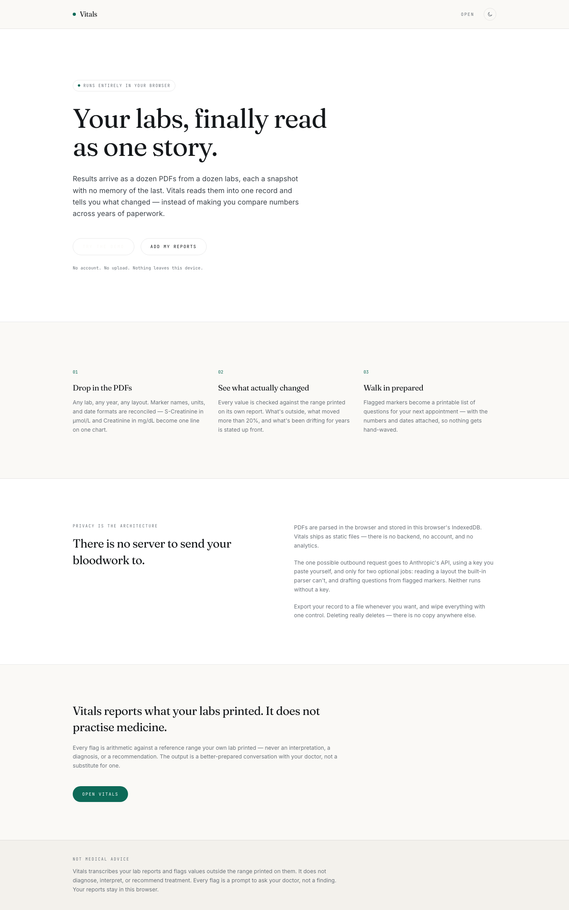
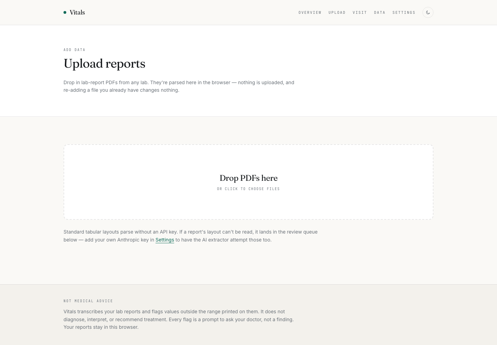
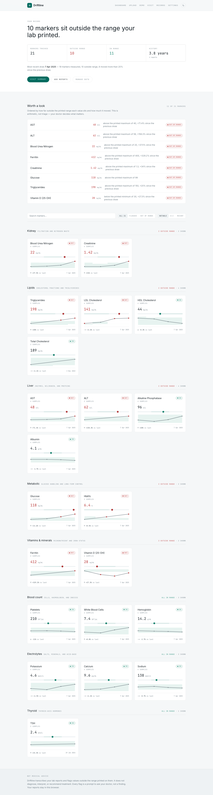
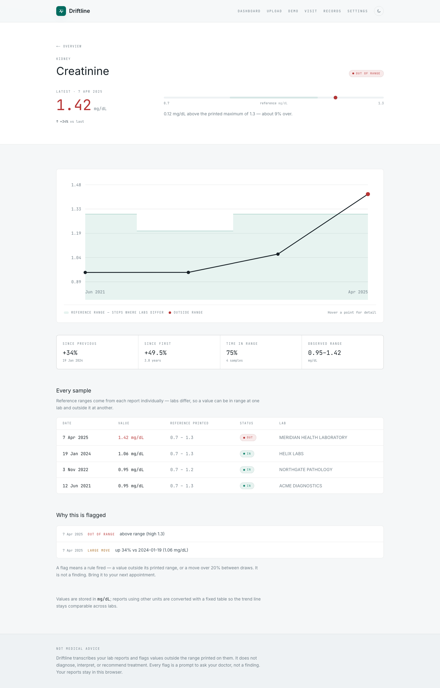
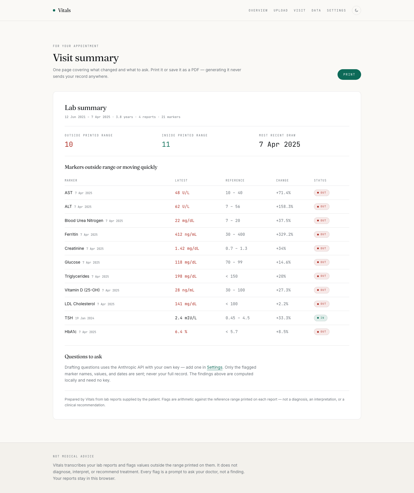
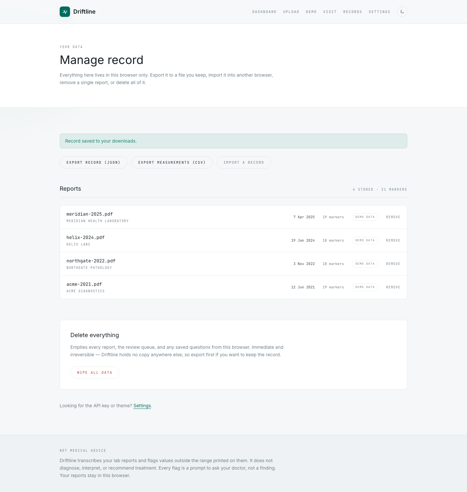

# Driftline

Driftline turns scattered lab-report PDFs into one local, longitudinal health record.

It runs in the browser, stores reports in that browser's IndexedDB, normalizes markers across labs and units, flags values against the reference ranges printed on the original reports, and prepares a visit-ready summary you can take to your next appointment.

[Live app](https://driftline-eosin.vercel.app)



## Why It Exists

Lab results usually arrive as separate PDFs from different labs, different years, and different layouts. That makes the important question hard to answer:

What changed?

Driftline reads the pile into one record so you can see trends, drift, out-of-range values, and the exact numbers behind the questions you want to ask your doctor.

Driftline does not diagnose, interpret, or recommend treatment. It reports what the lab printed and helps prepare better conversations.

## Product Flow

### 1. Add Reports

Drop in lab-report PDFs. Standard tabular layouts parse locally without an API key. Files with unusual layouts are held for review instead of being silently guessed.



### 2. Read The Dashboard

The dashboard groups markers, highlights values outside the printed reference range, and shows movement over time.



### 3. Inspect A Marker

Marker detail pages show the full series, date-stamped values, reference ranges, status, and drift history.



### 4. Prepare The Visit

The visit summary is the printable output: counts, date range, flagged markers, and optional drafted questions generated only from flagged values.



### 5. Own The Record

Export the record to a file, import it into another browser, delete individual reports, or wipe the local workspace.



## Demo And Real Modes

Driftline has two workspaces:

- **Demo mode** loads synthetic sample PDFs from `public/demo/` and labels them as demo data.
- **Real mode** is for the user's own PDFs and stays separate from sample data.

The demo uses the same parser, storage, dashboard, records page, and visit summary as real uploads. It is a safe way to evaluate the product without mixing sample reports into a personal record.

## Privacy Model

Driftline is local-first.

- Reports are parsed in the browser.
- Records live in IndexedDB in the current browser profile.
- Export/import uses files on disk, not a server.
- Duplicate uploads are ignored by content hash.
- The only optional outbound request is to Anthropic's API, directly from the browser, when the user adds their own key.
- A key is stored locally in `localStorage`.
- The AI extractor is a fallback for layouts the deterministic parser cannot read.
- Question drafting sends only flagged marker names, values, and dates.

There is no app account, no Driftline backend, and no analytics pipeline in this repo.

## Architecture

```text
PDF file
  -> pdf.js text extraction
  -> heuristic parser
  -> zod validation
  -> unit normalization
  -> IndexedDB storage
  -> timeline series builder
  -> drift/flag engine
  -> dashboard, marker pages, records, visit summary
```

Optional fallback path:

```text
Unreadable report text
  -> Anthropic API using the user's key
  -> same zod schema
  -> retry once
  -> store clean result or send to review queue
```

Core engine code lives in `lib/engine/` and stays independent of React. Storage lives in `lib/storage/`. LLM boundaries live in `lib/llm/`. The UI is a Next.js App Router app under `app/`.

## Tech Stack

- Next.js 16
- React 19
- TypeScript
- Tailwind CSS
- pdf.js
- IndexedDB via `idb`
- zod
- Vitest
- Playwright

## Getting Started

Install dependencies:

```bash
npm install
```

Run the development server:

```bash
npm run dev
```

Open the local URL printed by Next.js, usually:

```text
http://localhost:3000
```

## Scripts

```bash
npm run dev        # Start Next.js locally
npm run lint       # Run ESLint
npm test           # Run Vitest test suite
npm run build      # Build production app
npm run fixtures   # Regenerate synthetic PDF fixtures
npm run verify:ui  # Browser verification flow
```

## Fixtures And Tests

The project includes synthetic lab PDFs and expected parsed output:

- `tests/fixtures/pdfs/`
- `tests/fixtures/expected/`
- `scripts/generate-fixtures.ts`

The test suite covers parsing, normalization, drift logic, chart geometry, storage, exchange/import-export, and LLM fallback behavior with mocked responses.

Run:

```bash
npm test
```

## Deployment

The app is designed to deploy as a static/client-side Next.js app. The current production deployment is on Vercel:

[https://driftline-eosin.vercel.app](https://driftline-eosin.vercel.app)

Build locally before deploying:

```bash
npm run lint
npm test
npm run build
```

## Security Notes

The app defines a Content Security Policy in `app/layout.tsx` that limits network egress to the app itself and `https://api.anthropic.com`.

The Anthropic endpoint is used only when a user supplies a key and invokes an AI-backed path. The deterministic parser, demo workspace, records, dashboard, and export/import flows work without any key.

## Documentation

- [Specification](docs/SPEC.md)
- [Architecture and product decisions](docs/DECISIONS.md)

## Medical Disclaimer

Driftline is not medical advice. It transcribes lab reports, reconciles values, and flags values against ranges printed by the reporting lab. Every flag is a prompt to ask a clinician, not a diagnosis or treatment recommendation.
