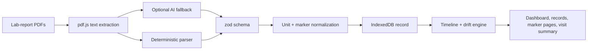

# Driftline

Local-first lab-report intelligence.

Driftline turns scattered lab-report PDFs into one browser-local health record: timelines, marker trends, printed-range flags, records management, and a visit-ready summary.

[Live app](https://driftline-eosin.vercel.app)

## What It Does

| Flow | What happens |
| --- | --- |
| **Add reports** | Drop in PDFs from any lab. Standard tables parse locally without a key. |
| **Read changes** | Markers are normalized across names and units, then shown as one timeline. |
| **Spot flags** | Values are checked against the reference range printed on their own report. |
| **Prepare visits** | Build a concise summary with numbers, dates, and optional question drafts. |
| **Own the record** | Export, import, remove reports, or wipe the browser-local workspace. |

## Modes

| Mode | Purpose |
| --- | --- |
| **Demo** | Loads synthetic sample PDFs so the whole workflow can be tried safely. |
| **Real** | Keeps personal PDFs separate from demo data and stored only in this browser. |

## Privacy Boundary

- No account.
- No Driftline backend.
- No analytics pipeline in this repo.
- Reports are parsed in the browser.
- Records are stored in IndexedDB.
- Export/import uses local files.
- Duplicate PDFs are ignored by content hash.
- Anthropic is contacted only when the user supplies a key for optional AI extraction or question drafting.

Driftline is not medical advice. It reports what the lab printed and helps prepare better questions for a clinician.

## Architecture



The optional AI fallback is used only when a user supplies an Anthropic key. It reads unusual layouts into the same schema as the deterministic parser; otherwise unreadable files stay in review.

Core logic lives in `lib/engine/`, storage in `lib/storage/`, LLM boundaries in `lib/llm/`, and the Next.js app in `app/`.

## Future Scope

- More lab-layout templates for higher no-key extraction coverage.
- Guided review for unreadable rows before they enter the record.
- Better export formats for clinicians and personal archives.
- Optional encrypted sync while keeping local-first ownership.
- Broader marker normalization across regional naming and unit conventions.

## Tech

Next.js 16, React 19, TypeScript, Tailwind CSS, pdf.js, IndexedDB via `idb`, zod, Vitest, Playwright.

## Run Locally

```bash
npm install
npm run dev
```

Then open the local URL printed by Next.js.

## Verify

```bash
npm run lint
npm test
npm run build
```

Useful extras:

```bash
npm run fixtures   # Regenerate synthetic PDF fixtures
npm run verify:ui  # Browser verification flow
```
